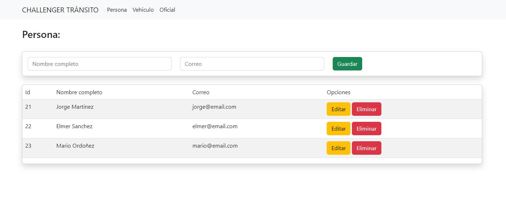
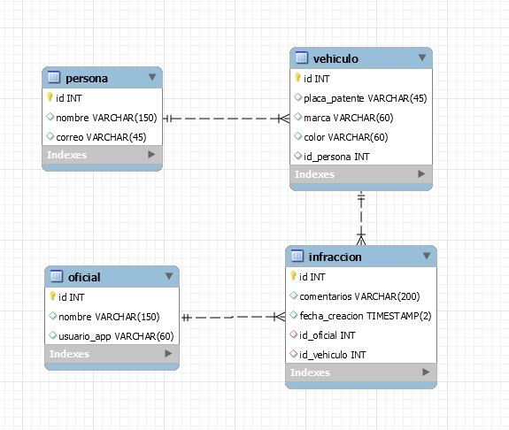

# CHALLENGER TRANSITO



### Requisitos generales

- python 3.8
- mysql 5.7 o superior
- Instalar *Pipenv* => ```pip install pipenv```

### Instalación del sistema
Se va desplegar en un entorno virtual de python.
Clonamos el proyecto:
```bash
git clone https://github.com/edr122/transito-app.git
cd transito-app
```
Creamos el entorno virtual
```bash
pipenv shell
```
Instalamos todos requerimientos (dependencias)
```bash
pipenv install -r requirements.txt
```
Ejecutar el proyecto
```bash
python main.py
```
Nota: El proyecto se va ejecutar en el puerto 3000  *Ejemplo:http://localhost:3000/*

### Cargar la base de datos
Diagrama de base de datos



Ejecutar el siguiente script [db_estructura.sql](db_estructura.sql) para cargar la información

**IMPORTANTE:** Actualizar la configuración de base de datos en el archivo [db.py](db.py)
```python
# Mysql Settings
app.config['MYSQL_HOST'] = 'localhost'
app.config['MYSQL_USER'] = 'xxxx'
app.config['MYSQL_PASSWORD'] = 'xxxx'
app.config['MYSQL_DB'] = 'xxxx'
```

## EJECUTAR DESDE DOCKER

La imagen de la aplicación en dockerhub está como [edr122/transito_app](https://hub.docker.com/r/edr122/transito_app).
Para desplegar conjuntamente con la base datos tenemos que ejecutar el archivo [docker-compose.yml](docker-compose.yml).
```bash
docker-compose up -d
```
luego ingresamos a la siguiente dirección: *http://localhost:5000/* y listo.
